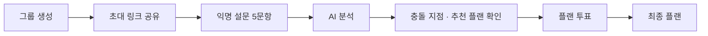

# Trip Truth

**각자의 취향을, 하나의 여행으로**

눈치 보지 않고 솔직하게 답한 여행 취향을 AI가 분석해,
그룹 모두가 납득할 수 있는 여행 플랜을 추천하는 서비스

<br />


**[배포 링크](<!-- TODO: 배포 URL -->)** · 2026.05.12 ~ 2026.05.29 · 멋쟁이사자처럼 부기톤

</div>

---

## About

친구들과 여행을 계획할 때, 예산이나 하고 싶은 활동을 솔직하게 말하기란 생각보다 어렵습니다.
목소리가 큰 사람의 의견대로 정해지고, 조용한 사람의 불만은 여행 중에 터지곤 하죠.

**Trip Truth**는 그룹원 각자가 **익명으로** 여행 취향을 답하면,
AI가 답변 사이의 **충돌 지점**을 찾고 **묻힌 목소리에 가중치**를 두어 모두에게 부담 없는 플랜을 추천합니다.
그룹은 추천된 플랜 중 하나에 투표해 최종 여행을 확정합니다.

## User Flow



| 단계            | 설명                                                         |
| --------------- | ------------------------------------------------------------ |
| **그룹 생성**   | 닉네임과 여행 기간·날짜를 입력해 그룹을 만들고 초대 링크를 받습니다. |
| **초대 · 참여** | 링크 복사 또는 카카오톡으로 친구를 초대합니다. 그룹원의 설문 입력 현황을 실시간으로 확인합니다. |
| **익명 설문**   | 여행 무드, 하고 싶은 활동, 피하고 싶은 것, 솔직한 1인 예산, 하고 싶은 말을 답합니다. 누가 어떤 답을 했는지 다른 멤버는 알 수 없습니다. |
| **AI 분석**     | 수집 → 충돌 지점 발견 → 묻힌 목소리 가중치 → 최적 플랜 설계 4단계로 분석합니다. |
| **결과 · 투표** | AI가 발견한 갈등(예산 차이, 액티비티 vs 휴양, 묻힌 제약)과 추천 플랜 TOP 3를 확인합니다. 각 플랜에는 예산 수준과 그룹 만족도가 표시되고, 일정마다 어떤 멤버의 취향을 반영했는지 보여줍니다. |
| **최종 플랜**   | 전체 투표 결과와 함께 가장 많은 표를 받은 플랜을 최종 여행으로 확정합니다. |

### 그룹 상태

그룹은 서버의 상태값에 따라 진행되며, 어떤 경로로 들어와도 현재 상태에 맞는 화면으로 이동합니다.

```
GATHERING(설문 수집) → ANALYZING(분석 중) → VOTING(투표 중) → COMPLETED(완료)
                                    ↘ FAILED(분석 실패)
```

---

## Team

| 이름          | 역할     | 담당                                                         |
| ------------- | -------- | ------------------------------------------------------------ |
| **고명준**    | Frontend | 프로젝트 초기 세팅, 그룹 생성·참여, AI 분석, 결과·투표, 최종 플랜, 에러 처리, 배포 |
| **김성빈** | Frontend | 익명 설문(Q1~Q5), 그룹 대기·입력 현황, 카카오톡 공유         |

---

## 담당 부분

### 프로젝트 기반 세팅

- Vite + React 프로젝트 초기 구성, React Router, 절대 경로(`@/`), Prettier, 전역 스타일·reset 설정
- 공통 Axios 인스턴스와 폴더 구조, GitHub 이슈·PR 템플릿 구성
- Vercel 배포, `rewrites`를 이용한 API 프록시 설정, PWA, Vercel Analytics·Speed Insights 적용

### 그룹 생성 · 참여

- 닉네임 → 여행 정보 2단계 그룹 생성 폼과 캘린더 바텀시트(DayPicker) 구현
- 초대 링크로 진입한 사용자를 그룹 상태(`ANALYZING` / `VOTING` / `COMPLETED`)에 따라 해당 화면으로 분기
- 닉네임 중복 입력 시 안내 처리

### AI 분석 화면

- 분석 4단계(수집 · 분석 · 가중치 · 추천)를 순차적으로 보여주는 진행 애니메이션
- 마지막 단계에서 그룹 상태를 주기적으로 조회해, 분석이 끝나면 결과 화면으로, 실패하면 안내 다이얼로그로 전환

### 결과 · 투표 · 최종 플랜

- AI가 발견한 갈등 카드, 순위·예산·만족도 태그가 붙은 추천 플랜 TOP 3, 플랜 투표 기능 구현
- 전체 투표 결과와 최종 선정 플랜 화면 구현

### 에러 처리

- `AppErrorBoundary`로 렌더링 에러를 잡아 전용 Fallback 화면 제공
- 분석 실패, 잘못된 경로, 결과 충돌 상황별 Fallback UI 구현

---

## Troubleshooting

### 1. 비용이 큰 분석 요청이 중복 전송되던 문제

**문제**
분석 화면에 진입하면 그룹장이 AI 분석 시작 요청(`POST /analyze`)을 보냅니다.
그런데 이 요청이 한 번이 아니라 여러 번 전송되는 현상이 있었습니다.
개발 모드의 `StrictMode`는 effect를 두 번 실행하고, effect의 의존성이 바뀔 때도 다시 실행되기 때문입니다.
AI 분석은 서버 비용이 가장 큰 요청이라, 중복 전송은 그대로 비용 낭비로 이어집니다.

**해결**
`useRef`로 요청 시작 여부를 기록해, effect가 몇 번 실행되든 분석 요청은 한 번만 보내도록 했습니다.
또한 그룹장(`LEADER`)만 요청을 보내도록 조건을 두어, 그룹원이 동시에 화면에 들어와도 요청이 겹치지 않게 했습니다.

```js
const hasStartedAnalysisRef = useRef(false);

useEffect(() => {
  if (!tripGroupId || hasStartedAnalysisRef.current || role !== 'LEADER') return;
  hasStartedAnalysisRef.current = true;
  startAnalysis();
}, [tripGroupId, role, onError]);
```

### 2. 한 그룹에서 투표하면 다른 그룹에서도 "이미 투표했어요"가 뜨던 문제

**문제**
처음에는 투표 여부를 `localStorage`의 `voting` 키 하나에 `true`로만 저장했습니다.
그래서 한 사용자가 여러 그룹에 참여하면, 첫 그룹에서 투표한 순간 다른 모든 그룹에서도 투표가 막혔습니다.

**해결**
투표 기록을 **초대 코드별**로 저장하고, `tripGroupId`와 `memberId`가 모두 일치할 때만 투표한 것으로 판단하도록 바꿨습니다.
서버가 이미 반영된 투표에 `409`를 반환하는 경우에도 로컬 기록을 동기화해, 화면과 서버 상태가 어긋나지 않게 했습니다.

```js
function isSameVoteOwner(vote, tripGroupId, memberId) {
  return (
    String(vote.tripGroupId) === String(tripGroupId) &&
    String(vote.memberId) === String(memberId)
  );
}
```

---

## 회고 · 남은 개선점

- **상태 폴링에 종료 조건이 없습니다.** 서버가 계속 `ANALYZING`을 반환하면 조회가 끝나지 않으므로, 최대 시도 횟수나 타임아웃이 필요합니다.
- **JavaScript로 작성했습니다.** API 응답 구조가 자주 바뀌는 상황에서 필드명 오류가 여러 번 있었고, 다음 프로젝트에서는 TypeScript로 응답 타입을 먼저 정의하려 합니다.

---

## Getting Started

### Environment Variables

```env
VITE_API_BASE_URL=/api
```

> 배포 환경에서는 `vercel.json`의 `rewrites`가 `/api` 요청을 백엔드 서버로 프록시합니다.

### Run

```bash
git clone https://github.com/kmj0973/trip-truth.git
cd trip-truth
npm install
npm run dev
```

---

## 

## 📝 폴더 구조

```bash
src
├── apis        # 서버 통신 및 API 요청 관련 로직 관리
├── assets      # 이미지, 폰트, 아이콘 등 정적 리소스 관리
├── components  # 재사용 가능한 공통 UI 컴포넌트 관리
├── constants   # 프로젝트 전역에서 사용하는 상수 값 관리
├── hooks       # 커스텀 훅(Custom Hooks) 관리
├── layouts     # 공통 레이아웃 컴포넌트 관리
├── pages       # 페이지 단위 컴포넌트 관리
├── routes      # 라우팅 및 경로 관련 설정 관리
├── styles      # 전역 스타일 및 공통 스타일 파일 관리
└── utils       # 공통 유틸 함수 관리
```

## 🔧커밋 컨벤션

| Tag      | descrtion                                                           |
| -------- | ------------------------------------------------------------------- |
| feat     | 새로운 기능을 추가하는 경우                                         |
| fix      | 버그를 고친경우                                                     |
| docs     | 문서를 수정한 경우                                                  |
| style    | 코드 포맷 변경, 세미콜론 누락, 코드 수정이 없는경우                 |
| refactor | 코드 리펙토링                                                       |
| test     | 테스트 코드. 리펙토링 테스트 코드를 추가했을 때                     |
| chore    | 빌드 업무 수정, 패키지 매니저 수정                                  |
| design   | CSS 등 사용자가 UI 디자인을 변경했을 때                             |
| rename   | 파일명(or 폴더명) 을 수정한 경우                                    |
| remove   | 코드(파일) 의 삭제가 있을 때. "Clean", "Eliminate" 를 사용하기도 함 |
